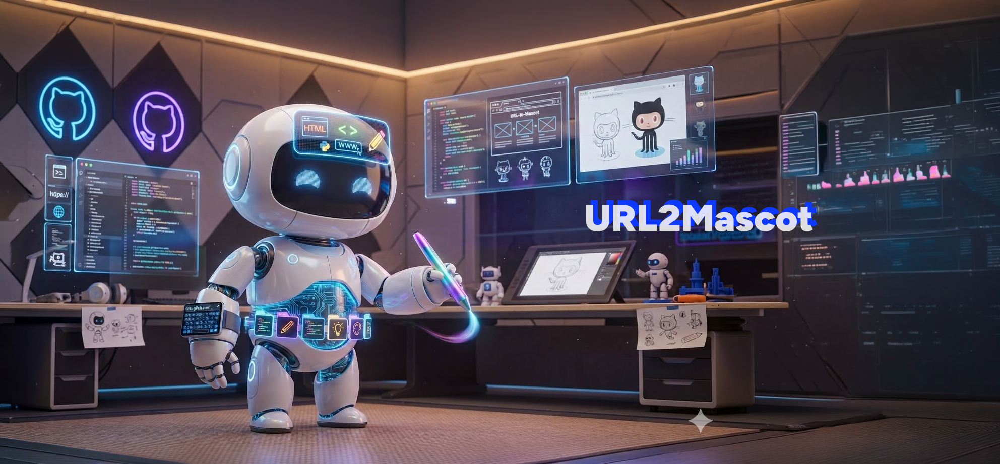

<div align="center">
  
</div>

# URL to Mascot

<p align="center">
  
  
  
  
  
</p>

<p align="center">
  Guess what your website mascot would be, then turn that guess into a 3D concept, a polished prompt, and a fast preview image.
</p>

<p align="center">
  Drop in a domain. Discover the mascot hiding inside it.
</p>

<p align="center">
  <a href="#quick-start">Quick Start</a> •
  <a href="#what-it-does">What It Does</a> •
  <a href="#workflow">Workflow</a> •
  <a href="#model-support">Model Support</a> •
  <a href="#development">Development</a>
</p>

## Overview

URL to Mascot is an AI visual concept generator built around one playful question:
what would this website look like as a mascot?
It reads the meaning behind a domain, guesses the character hiding inside it, and turns that idea into a 3D concept plus an English prompt ready for image generation.

- Convert a plain URL into a character brief with personality, materials, accessories, scene, and lighting.
- Generate a six-part output flow that is easy to edit, review, and reuse.
- Produce preview images with Gemini image models or OpenAI image generation.

View the AI Studio app: https://ai.studio/apps/c2ff7197-fe31-4aa0-bdf0-e75fb3bcf085

## What It Does

### 1. Guesses the mascot

The core idea is simple: paste a URL and let the app guess what kind of mascot that website wants to be.

### 2. Reads the brand signal

The app interprets a target domain through naming, service meaning, and implied visual identity.

### 3. Builds the mascot concept

It generates:

1. Core concept and visual keywords
2. Character species and body design
3. Tools, outfit, and signature accessories
4. Scene and interface-aware environment
5. Lighting and rendering direction
6. A final English image prompt

### 4. Pushes the concept toward an image

The final prompt can be copied, regenerated, and used immediately for preview image generation inside the app.

## Quick Start

### Prerequisites

- Node.js
- A Gemini API key for text generation
- An optional OpenAI API key for DALL-E preview images

### Install

```bash
npm install
```

### Configure

Create a `.env.local` file and set your Gemini key:

```bash
GEMINI_API_KEY="YOUR_GEMINI_API_KEY"
```

### Run

```bash
npm run dev
```

Open `http://localhost:3000` after the dev server starts.

## Workflow

1. Enter a target domain such as `spotify.com` or `tw.yahoo.com`.
2. Choose the text analysis provider and model.
3. Generate the mascot concept.
4. Review or edit the generated sections.
5. Regenerate the final English prompt if needed.
6. Generate a preview image from the prompt.

## Model Support

| Stage | Providers | Notes |
|-------|-----------|-------|
| Text analysis | Google Gemini | Recommended in the current browser-based test flow |
| Text analysis UI options | OpenAI, Anthropic | Present in the interface, but the current test environment recommends Gemini because of CORS limitations |
| Preview image generation | Gemini image models | Supports Gemini image generation flows directly in the app |
| Preview image generation | OpenAI DALL-E | Requires a direct OpenAI API key |

## Output Format

The generated concept is intentionally split for creative control:

| Section | Output |
|---------|--------|
| Section 1 | Core idea and style keywords |
| Section 2 | Mascot species, face, body, and material design |
| Section 3 | Props, outfit, and functional accessories |
| Section 4 | Environment and scene composition |
| Section 5 | Lighting and rendering mood |
| Section 6 | Final English visual prompt |

Notes:

- Sections 1 to 5 are generated in Traditional Chinese.
- Section 6 is always generated in English for image-model compatibility.
- The prompt is designed to frame the website name as a glowing neon hologram inside the scene.

## Development

```bash
npm run dev
npm run build
npm run lint
```

## Tech Stack

| Layer | Tools |
|-------|-------|
| Frontend | React 19, TypeScript, Vite |
| Motion | Motion |
| UI Icons | Lucide React |
| AI Text | Google Gemini |
| AI Image | Gemini image models, OpenAI DALL-E |

## Why This Project Is Fun

Most URL tools stop at metadata.
This one asks a better question: "guess what your website mascot is."
Then it turns that answer into something visual, character-driven, and surprisingly pitch-ready.
